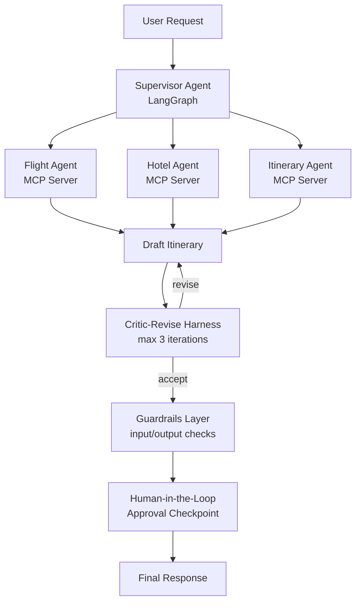

# 🧭 TripPlot

**Production-ready multi-agent travel planning system built with LangGraph + MCP — Supervisor Agent, Critic-Revise Harness, Guardrails, and Human-in-the-Loop.**

This project extends a basic multi-agent travel planner into a production-pattern architecture: a **Supervisor Agent** orchestrates specialized sub-agents over **MCP (Model Context Protocol)** servers, a **Critic-Revise Harness** iteratively improves the itinerary before it's shown to the user, **Guardrails** validate every input/output, and a **Human-in-the-Loop** checkpoint pauses execution before any consequential action is confirmed.

---

## ✨ What This Demonstrates

- **Bounded autonomy** — agents operate within a supervised graph, not freely
- **Self-improving output** — a Critic-Revise harness scores and refines the itinerary across bounded iterations before it ever reaches the user
- **Auditable decision points** — every hop, including each critique/revision round, is traceable via LangGraph state
- **Guardrails enforcement** — inputs and outputs are validated, not trusted blindly
- **Human approval gates** — the system pauses for confirmation before committing to an action
- **Modular tool access via MCP** — sub-agents call external services (flights, hotels, weather) through standardized MCP servers, not hardcoded API calls

---

## 🏗️ Architecture

**Flow:** User request → Supervisor routes to relevant sub-agent(s) → sub-agents produce a draft itinerary → Critic-Revise Harness scores the draft and requests revisions (up to 3 rounds, or until it passes) → Guardrails validate the final output → graph pauses for human approval on consequential steps → execution resumes → final itinerary/response returned.

---

## 🔁 Critic-Revise Harness

A dedicated critique loop sits between draft generation and the Guardrails layer, catching quality issues before they ever reach the user:

1. Sub-agents (Flight/Hotel/Itinerary) produce a draft itinerary
2. A Critic agent evaluates the draft against the original request (budget, dates, preferences, feasibility)
3. If the draft falls short, the Critic returns specific feedback and the draft is sent back for revision
4. This repeats for **up to 3 iterations** — the harness stops early if the Critic accepts the draft, or after the 3rd round regardless of outcome
5. The best/final draft is passed downstream to Guardrails

This bounds the agent's "perfectionism" loop so it can't spin indefinitely, while still giving weak first drafts a chance to improve before a human ever sees them.

---

## 🧩 Tech Stack

| Layer | Tool |
|---|---|
| Agent orchestration | [LangGraph](https://github.com/langchain-ai/langgraph) |
| Tool/service access | [MCP (Model Context Protocol)](https://modelcontextprotocol.io/) |
| Critic-Revise harness | LangGraph conditional edges (bounded loop, max 3 iterations) |
| LLM | Groq (configurable) |
| Guardrails | Guardrails AI / NeMo Guardrails |
| External data | Tavily (search), OpenWeather (weather) |
| Persistence / checkpointing | Postgres |
| Frontend | Streamlit |

---

## 🧑‍⚖️ Human-in-the-Loop Flow

When the Supervisor Agent reaches a consequential step (e.g., finalizing a booking recommendation), the graph **interrupts execution** and surfaces the proposed action to the user for approval:

1. Agent proposes an action (already refined by the Critic-Revise Harness)
2. Graph pauses (`interrupt()`) and persists state
3. User reviews and approves / edits / rejects
4. Graph resumes from the checkpoint with the human decision applied

---

## 🛡️ Guardrails

Every agent response passes through a validation layer before reaching the Supervisor or the user:

- **Input validation** — sanitizes and checks user queries before they're routed
- **Output validation** — checks agent responses for schema compliance, hallucinated fields, and policy violations
- **Fallback handling** — invalid outputs trigger a retry or escalate to human review rather than failing silently

## 📄 License

MIT

# TripPlot-AI
