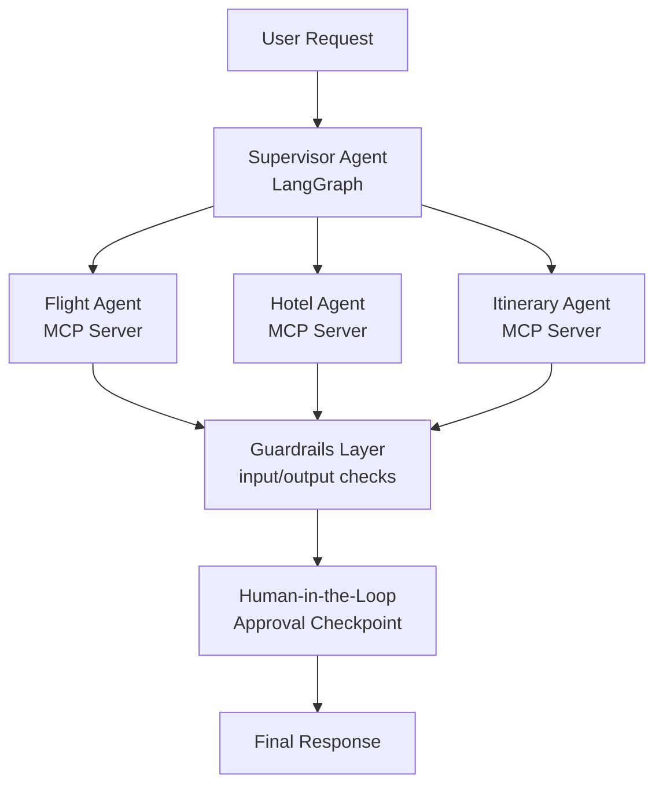

# 🧭 Supervised Agent Framework

**Production-ready multi-agent travel planning system built with LangGraph + MCP — Supervisor Agent, Guardrails, and Human-in-the-Loop.**

This project extends a basic multi-agent travel planner into a production-pattern architecture: a **Supervisor Agent** orchestrates specialized sub-agents over **MCP (Model Context Protocol)** servers, with **Guardrails** validating every input/output and a **Human-in-the-Loop** checkpoint pausing execution before any consequential action is confirmed.

---

## ✨ What This Demonstrates

- **Bounded autonomy** — agents operate within a supervised graph, not freely
- **Auditable decision points** — every hop is traceable via LangGraph state
- **Guardrails enforcement** — inputs and outputs are validated, not trusted blindly
- **Human approval gates** — the system pauses for confirmation before committing to an action
- **Modular tool access via MCP** — sub-agents call external services (flights, hotels, weather) through standardized MCP servers, not hardcoded API calls

---

## 🏗️ Architecture

**Flow:** User request → Supervisor routes to relevant sub-agent(s) → Guardrails validate output → graph pauses for human approval on consequential steps → execution resumes → final itinerary/response returned.

---

## 🧩 Tech Stack

| Layer | Tool |
|---|---|
| Agent orchestration | [LangGraph](https://github.com/langchain-ai/langgraph) |
| Tool/service access | [MCP (Model Context Protocol)](https://modelcontextprotocol.io/) |
| LLM | Groq (configurable) |
| Guardrails | Guardrails AI / NeMo Guardrails |
| External data | Tavily (search), OpenWeather (weather) |
| Persistence / checkpointing | Postgres |
| Frontend | Streamlit |

---

## 🧑‍⚖️ Human-in-the-Loop Flow

When the Supervisor Agent reaches a consequential step (e.g., finalizing a booking recommendation), the graph **interrupts execution** and surfaces the proposed action to the user for approval:

1. Agent proposes an action
2. Graph pauses (`interrupt()`) and persists state
3. User reviews and approves / edits / rejects
4. Graph resumes from the checkpoint with the human decision applied

---

## 🛡️ Guardrails

Every agent response passes through a validation layer before reaching the Supervisor or the user:

- **Input validation** — sanitizes and checks user queries before they're routed
- **Output validation** — checks agent responses for schema compliance, hallucinated fields, and policy violations
- **Fallback handling** — invalid outputs trigger a retry or escalate to human review rather than failing silently

## 📄 License

MIT
# TripPlot-AI
