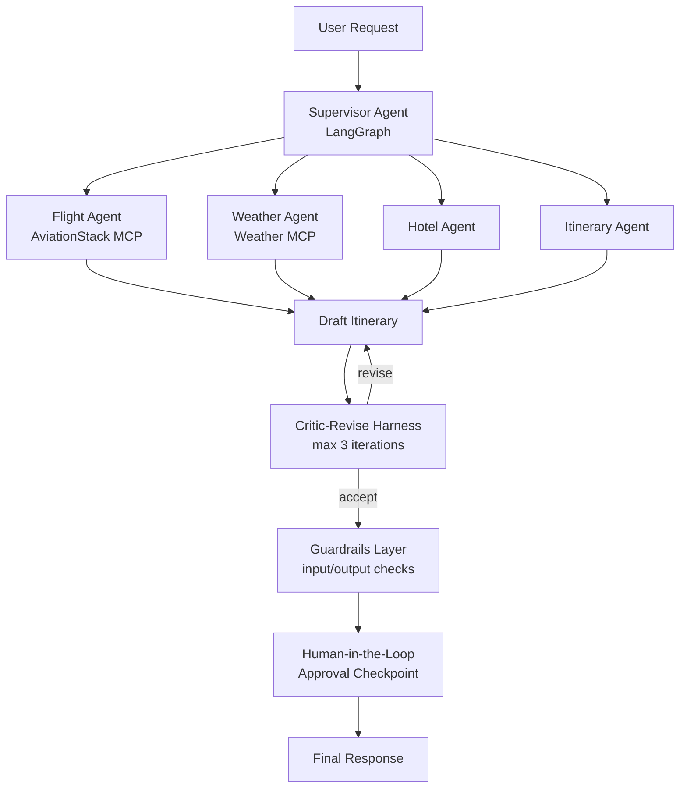

# 🧭 TripPlot

**Production-ready multi-agent travel planning system built with LangGraph + MCP — Supervisor Agent, Critic-Revise Harness, Guardrails, and Human-in-the-Loop.**

TripPlot extends a basic multi-agent travel planner into a production-pattern architecture. A **Supervisor Agent** orchestrates specialized sub-agents over **MCP (Model Context Protocol)** servers, a **Critic-Revise Harness** improves the itinerary before anyone sees it, **Guardrails** validate inputs and outputs, and a **Human-in-the-Loop** checkpoint pauses execution before any consequential action is confirmed.

🔗 **Live demo:** [tripplot-ai-frontend.streamlit.app](https://rj1230-tripplot-ai-frontend-6cg2mj.streamlit.app/)

---

## ✨ Key Features

- **Supervisor-orchestrated agents** — bounded autonomy: agents operate inside a supervised LangGraph, not freely
- **Critic-Revise Harness** — scores and refines the itinerary across up to 3 bounded iterations before it reaches the user
- **Guardrails** — inputs and outputs are validated, not trusted blindly
- **Human approval gates** — the graph pauses for confirmation before committing to an action
- **Modular tool access via MCP** — sub-agents call flights, hotels, and weather through standardized MCP servers, not hardcoded API calls
- **Auditable decisions** — every hop, including each critique and revision round, is traceable via LangGraph state

---

## 🏗️ Architecture


```mermaid
flowchart TD
    A[User Request] --> B[Supervisor Agent<br/>LangGraph]
    B --> C[Flight Agent<br/>AviationStack MCP]
    B --> W[Weather Agent<br/>Weather MCP]
    B --> D[Hotel Agent]
    B --> E[Itinerary Agent]
    C --> F[Draft Itinerary]
    W --> F
    D --> F
    E --> F
    F --> R[Critic-Revise Harness<br/>max 3 iterations]
    R -->|revise| F
    R -->|accept| G[Guardrails Layer<br/>input/output checks]
    G --> H[Human-in-the-Loop<br/>Approval Checkpoint]
    H --> I[Final Response]
```

1. **Request** — the user submits a travel request
2. **Supervisor** — routes it to the relevant sub-agents (Flight, Weather, Hotel, Itinerary); flight and weather data come through MCP servers
3. **Draft** — the sub-agents produce a draft itinerary
4. **Critic-Revise** — the draft is scored and revised for up to 3 rounds, or until it passes
5. **Guardrails** — the final output is validated
6. **Human approval** — the graph pauses on consequential steps and resumes with the human decision
7. **Response** — the final itinerary is returned

---

## 🧩 Tech Stack

| Layer | Tool |
|---|---|
| Agent orchestration | [LangGraph](https://github.com/langchain-ai/langgraph) |
| Tool / service access | [MCP (Model Context Protocol)](https://modelcontextprotocol.io/) |
| Critic-Revise harness | LangGraph conditional edges (bounded loop, max 3 iterations) |
| LLM | Groq (configurable) |
| Guardrails | Guardrails AI / NeMo Guardrails |
| External data | AviationStack (flights), Tavily (search), OpenWeather (weather) |
| Persistence / checkpointing | Postgres |
| Frontend | Streamlit |

---

## 📂 Project Structure

```
TripPlot-AI/
├── agents.py                # Agent definitions
├── graph.py                 # LangGraph workflow
├── critic.py                # Critic agent for the Critic-Revise Harness
├── state.py                 # Shared graph state
├── mcp_client.py            # MCP client
├── weather_mcp_server.py    # Weather MCP server
├── aviationstack-mcp        # AviationStack flight-data MCP server
├── tools/
├── config.py                # Settings and API keys
├── frontend.py              # Streamlit app
├── main.py                  # Entrypoint
├── test.py
├── pyproject.toml
├── uv.lock
├── requirements.txt
└── .python-version
```

---

## 🚀 Quick Start

```bash
# 1. Clone and install
git clone https://github.com/rj1230/TripPlot-AI.git
cd TripPlot-AI
pip install -r requirements.txt

# 2. Add your API keys to a .env file (see the table below)

# 3. Launch the Streamlit app
streamlit run frontend.py
```

**Services you'll need keys for**

| Service | Used for |
|---|---|
| Groq | LLM |
| Tavily | Web search |
| OpenWeather | Weather data |
| AviationStack | Flight data |
| Postgres | Persistence and checkpointing |

---

## 🔁 Critic-Revise Harness

A dedicated critique loop sits between draft generation and the Guardrails layer, catching quality issues before they reach the user:

1. Sub-agents produce a draft itinerary
2. A Critic agent evaluates it against the original request — budget, dates, preferences, feasibility
3. If the draft falls short, the Critic returns specific feedback and the draft goes back for revision
4. The loop stops when the Critic accepts the draft or after the 3rd round, whichever comes first
5. The best or final draft moves on to Guardrails

The 3-round cap keeps the agent's "perfectionism" loop bounded, while still giving weak first drafts a chance to improve before a human sees them.

---

## 🛡️ Guardrails

Every agent response passes through a validation layer before reaching the Supervisor or the user:

- **Input validation** — sanitizes and checks user queries before they're routed
- **Output validation** — checks responses for schema compliance, hallucinated fields, and policy violations
- **Fallback handling** — invalid outputs trigger a retry or escalate to human review instead of failing silently

---

## 🧑‍⚖️ Human-in-the-Loop

When the Supervisor reaches a consequential step (for example, finalizing a booking recommendation), the graph **interrupts execution** and surfaces the proposed action for approval:

1. The agent proposes an action, already refined by the Critic-Revise Harness
2. The graph pauses (`interrupt()`) and persists its state
3. The user approves, edits, or rejects
4. The graph resumes from the checkpoint with the human decision applied

---

## 📄 License

MIT
